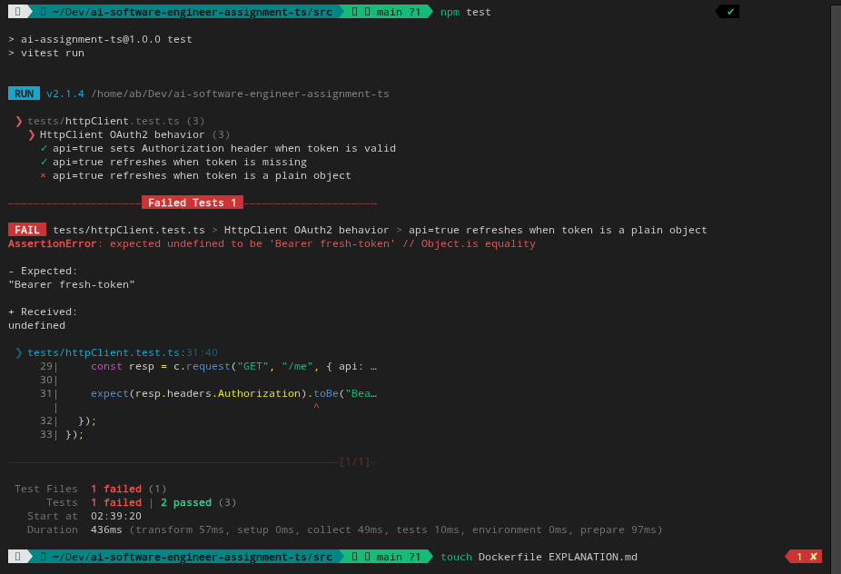
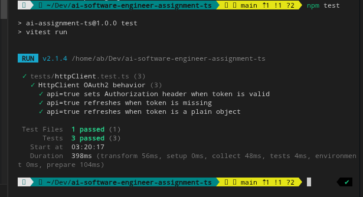

# Explanation

Hello, and thank you for taking the time to review my submission and thought process.

## Setup

First,I reviewed the repository structure and noticed a missing `package.json`, which is required to install dependencies and run the test suite. After creating it and confirming tests could run locally, I executed `npm test` to establish the baseline behavior.

## What was the bug?

So, I go over the `src/httpClient.ts` file. The HTTP client did not refresh the OAuth token when the token was a plain object instead of an instance of the `OAuth2Token` class. As a result, no `Authorization` header was added even though a refresh should have occurred.

## Why did it happen?

The refresh condition relied on truthiness and an `instanceof` check. A plain object token is truthy but not an instance of the expected class, so the refresh logic was skipped. No refactor, No wide code change, I only fixed 1 if clause as per the instruction.

## Why does the fix solve it?

The fix explicitly refreshes when the token is missing, not an instance of `OAuth2Token`, or expired. This ensures invalid token shapes are handled consistently while keeping the change minimal.

## Remaining edge cases

Tests do not currently cover malformed token objects (for example, missing fields), which could still cause unexpected behavior. The assignment emphasized keeping changes minimal and focused, so I did not introduce additional tests or a refactor for stricter validation. Stronger validation in `HttpClient.request()` could be added later if desired. and Oh, I took the screenshots for the test. 

### Test results before fix

### Test results after fix

Thank you!