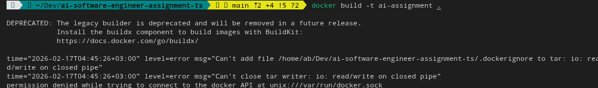
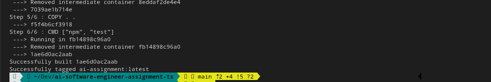

## Running Tests

### Run tests locally

Make sure Node.js is installed, then:

```bash
npm install
npm test
```

This installs dependencies from `package.json` and runs the test suite using Vitest.

---

## Running Tests with Docker

This project includes a Dockerfile so the tests can run in a clean, reproducible environment.

### 1. Build the Docker image

From the project root:

```bash
docker build -t ai-assignment .
```

### 2. Run the tests inside Docker

```bash
docker run --rm ai-assignment
```

The container will automatically execute `npm test` as configured in the Dockerfile.

---

## Docker Permission Notes (Linux)

If you see a permission error like this:


you have two options:

### Quick workaround (use sudo)

```bash
sudo docker build -t ai-assignment .
sudo docker run --rm ai-assignment
```


### Recommended long-term fix

Add your user to the Docker group:

```bash
sudo usermod -aG docker $USER
```

Then log out and back in (or reboot). After that, Docker commands should work without `sudo`.

## The final output will look like this
! [Test running on docker start](assets/docker-running.png)

